# Fashion Tech

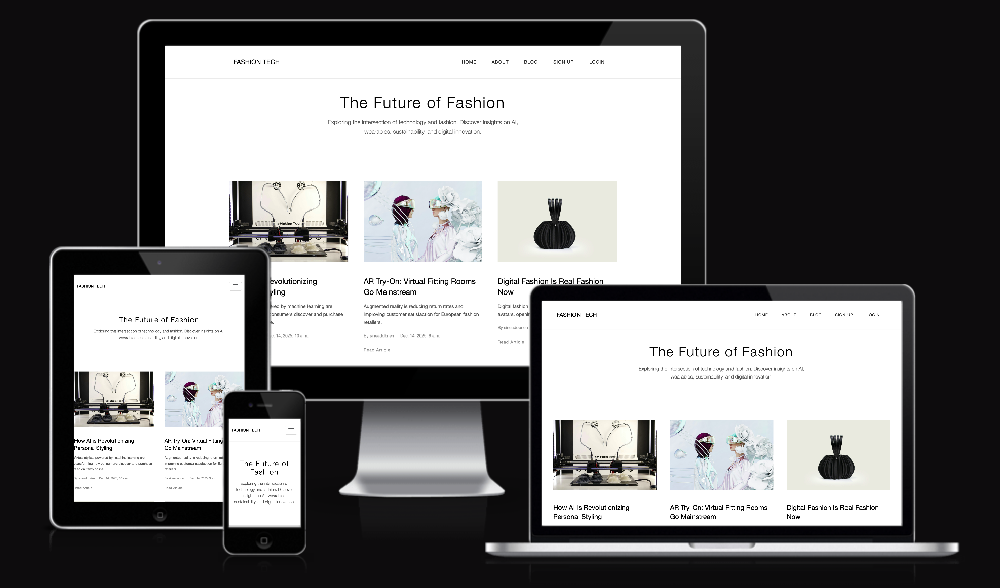

## Introduction
Fashion Tech is a blog sharing information on an emerging field in fashion, exploring the intersection of technology and fashion across Europe.

## Purpose
Fashion Tech is a content hub dedicated to covering the emerging technologies transforming the fashion industry. Fashion tech is an online space for individuals to explore news, insights and analysis about innovations in AI, wearable technology and digital fashion across European markets and fashion-tech forward companies.

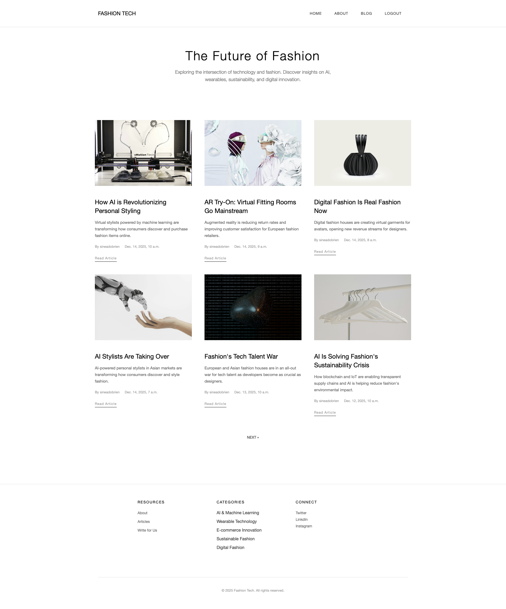

### Design 

* Minimalist Aesthetic: Clean, distraction-free interface utilising whitespace and typography-focused design. 

* Responsive Layout: Fully responsive design that adapts to desktop, tablet and mobile devices.

* Sticky Navigation: Fixed navigation bar for easy access to site sections while scrolling.

### Colour Scheme

* I choose a monochromatic color scheme to keep the focus on the content and people's attention directed to blog posts by including engaging imagery.

### Fonts

 **Font Family** Helvetica Neue, Arial, sans-serif
 **Type** System fonts for optimal performance
 **Style** Clean, minimal, and modern to match the Fashion Tech aesthetic

### Wireframes

The following pages are screenshots from my website:

### Wireframes

### Home/Blog page
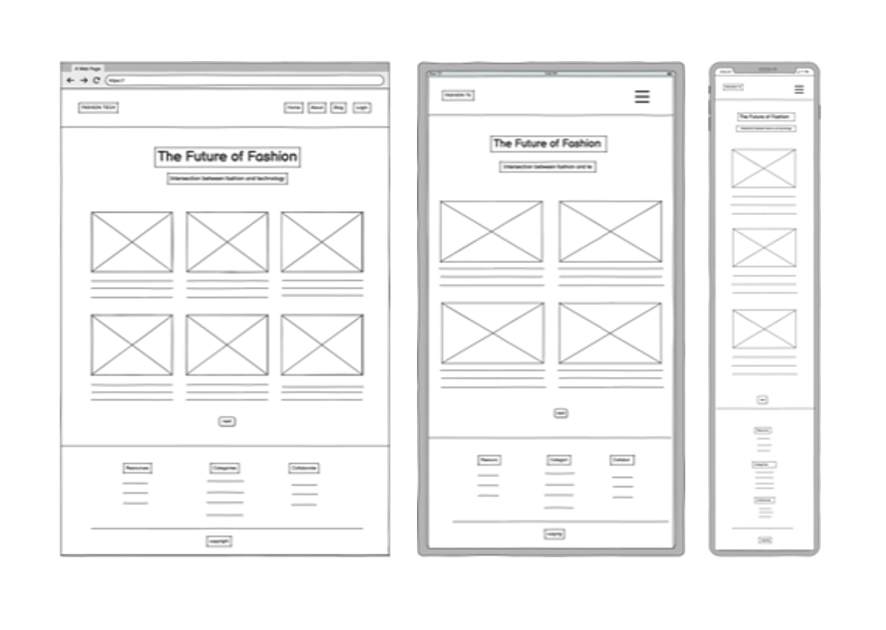

### About page
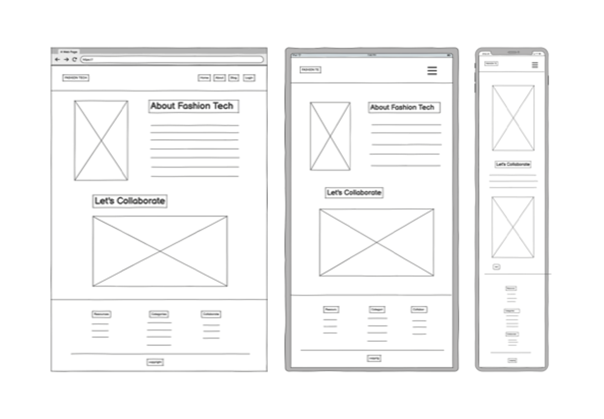

### Login page
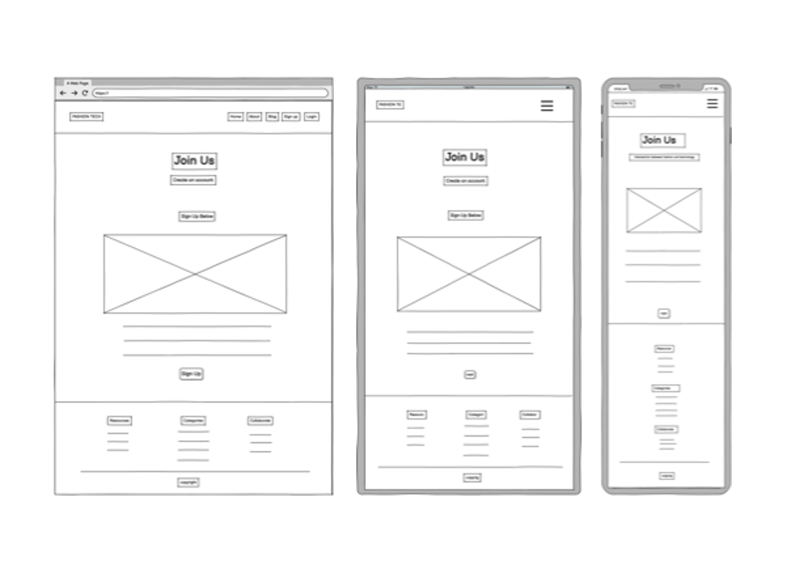

## Features

### Site Pages

#### Home Page
The home page serves as the main landing point for visitors to fashion tech. It displays a hero section with the tagline "The Future of Fashion" and a grid of featured articles covering topics in fashion tech such AI in fashion.

Each article card includes an image, title, excerpt, author, date, and "Read Article" link. The page includes pagination for browsing through all published articles. Navigation options vary based on authentication status - visitors see "Sign Up" and "Login" options, while authenticated users see "Logout".


#### About Page
This page provides information about Fashion Tech's mission and focus areas. It features a striking profile image alongside text explaining the platform's dedication to exploring innovation in the fashion industry. 

The page lists key coverage areas including AI & Machine Learning, Wearable Technology, E-commerce Innovation, Sustainable Fashion Technology, and Digital Fashion. A collaboration form at the bottom allows visitors to submit requests to contribute articles or discuss projects. The form includes fields for name, email, and message.


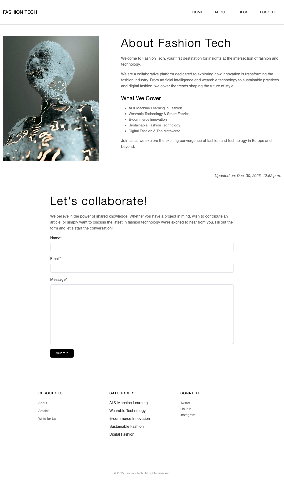

#### Sign Up Page
The registration page ("Join Us") allows new users to create an account with a clean, centered form. Users must provide a username, optional email address, and password (with confirmation). 

Password requirements are clearly displayed, including minimum length, complexity rules, and restrictions on common passwords. A link to the sign-in page is provided for existing users. The black "Sign Up" button follows the site's minimalist design aesthetic.


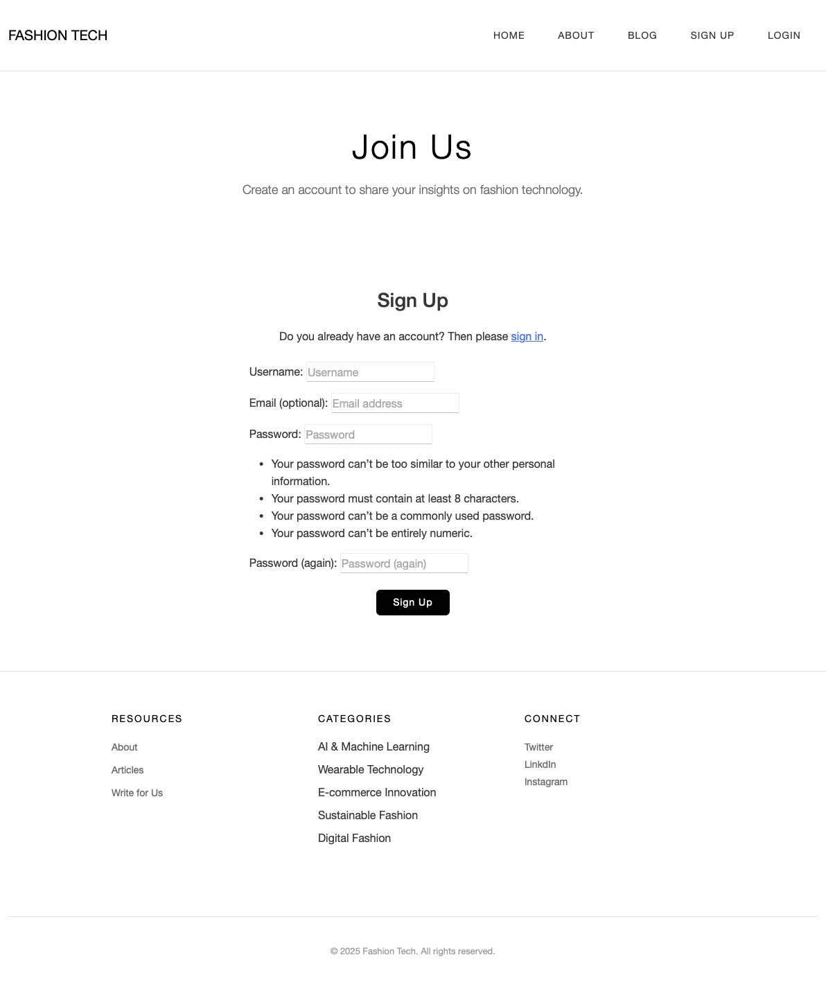

#### Sign In Page
The login page ("Welcome Back") features a simple authentication form with username and password fields, plus a "Remember Me" checkbox. Links direct new users to the registration page. 

Upon successful login, users receive a confirmation message and are redirected to the home page with full access to authenticated features. The consistent black button styling maintains the professional, minimalist design throughout.

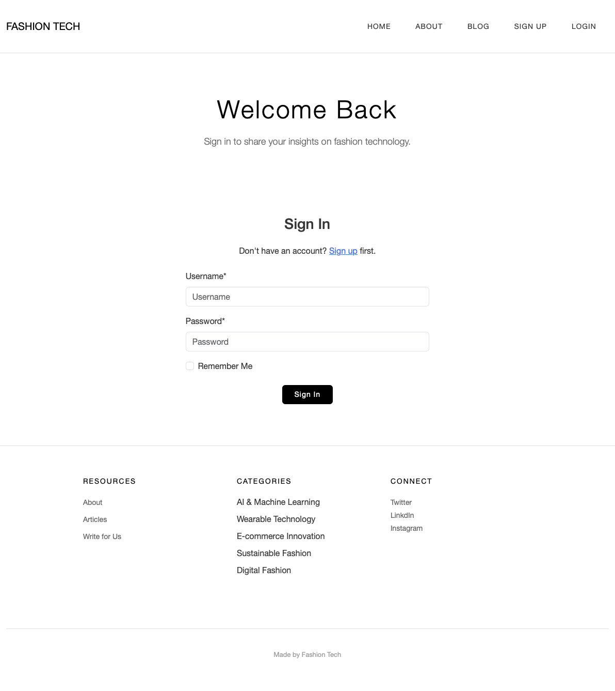

#### Logout Page
When logging out, users are presented with a confirmation page asking "Are you sure you want to sign out?" This prevents accidental logouts. 

After confirming, users receive a "You have signed out" success message and return to the home page as an unauthenticated visitor.

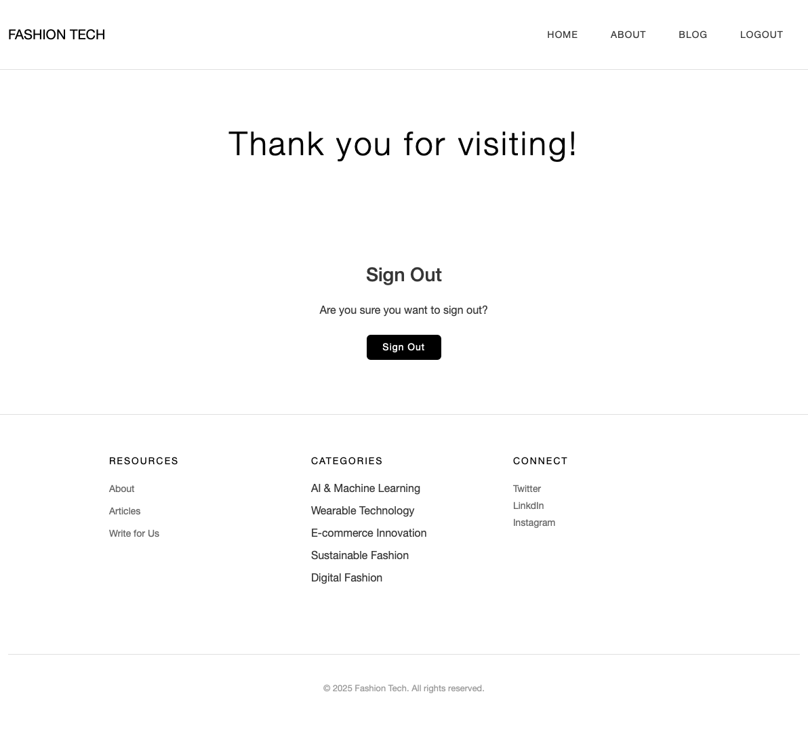

#### Navigation & Footer
The site features a consistent navigation bar across all pages with the "FASHION TECH" logo linking to the home page. Navigation links include Home, About, Blog, and authentication options (Sign Up/Login or Logout depending on status). 

The footer is organized into three sections: Resources (About, Articles, Write for Us), Categories (AI & Machine Learning, Wearable Technology, E-commerce Innovation, Sustainable Fashion, Digital Fashion), and Connect (social media links to Twitter, LinkedIn, and Instagram). Copyright information appears at the bottom.

#### Responsive Design
The site is fully responsive with a mobile-first approach. On smaller screens, the article grid adjusts to a single column layout, navigation condenses appropriately, and forms remain centered and accessible. All text and images scale properly across device sizes.

### User Actions

#### User Registration
New visitors can create an account by providing a username, optional email, and secure password meeting the specified requirements. See Sign-up image.

#### User Login
Existing users authenticate with their username and password, with an optional "Remember Me" feature for convenience.

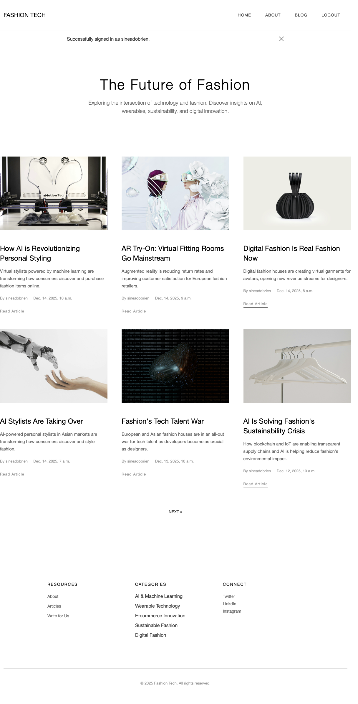

#### User Logout
Authenticated users can securely log out through a confirmation process, ensuring no accidental logouts occur.


#### Submit Collaboration Request
Any visitor can submit a collaboration form on the About page to propose article contributions or discuss fashion technology projects.

#### View Articles
All visitors can browse and read published articles on fashion technology topics.

#### Comment on Articles
Authenticated users can leave comments on articles, fostering community discussion around fashion tech innovations.

#### Edit Comments
Users can edit their own comments after posting, allowing them to correct or clarify their contributions.

#### Delete Comments
Comment authors can delete their own comments with a confirmation modal to prevent accidental deletions.

## User Stories

### Site Admin
- **As a Site Admin I can create, read, update and delete posts so that I can manage my blog content**
   - Given a logged-in user, they can create a blog post
   - Given a logged-in user, they can read a blog post
   - Given a logged-in user, they can update a blog post
   - Given a logged-in user, they can delete a blog post

- **As a Site Admin I can create draft posts so that I can finish writing the content later**
   - Given a logged in user, they can save a draft blog post
   - Then they can finish the content at a later time

- **As a Site Admin I can approve or disapprove comments so that I can filter out objectionable comments**
   - Given a logged-in user, they can approve a comment
   - Given a logged-in user, they can disapprove a comment

### Site User
- **As a Site User I can view a paginated list of posts so that I can select which posts I want to read**
   - Given more than one post in the database, these multiple posts are listed
   - When a user opens the main page, a list of posts is seen
   - Then the user sees all post titles with pagination to choose what to read

- **As a Site User/Admin I can view comments on an individual post so that I can read the conversation**
   - Given one or more user comments, the admin can view them
   - Then a site user can click on the comment thread and read the conversation

- **As a Site User I can click on a post so that I can read the full text**
   - When a blog post title is clicked on, a detailed view of the post is seen

- **As a Site User I can leave comments on a post so that I can interact in the online community**
   - When a user comment is approved
   - Then a user can reply
   - Given more than one comment, there is a conversation thread

- **As a Site User I can modify or delete my comment on a post so that I can be involved in the conversation**
   - Given a logged-in user, they can modify their comment
   - Given a logged-in user, they can delete their comment

- **As a Site User I can register an account so that I can comment on a post**
   - Given an email, a user can register an account
   - The user can login
   - When the user is logged in, they can comment

## Images

All images were sourced from [Unsplash](https://unsplash.com/)

## Languages

Technologies Used: 

* HTML used to create main site content
* CSS used for blog layout and site design
* JavaScript used for interactive comment functionality
* Python used for back-end programming
* Bootstrap used as front-end framework and pre-built components
* Django used as Python framework for the blog
* Django Allauth used for user authentication and account management
* Django Crispy Forms used for elegant form rendering
* Django Summernote used as WYSIWYG editor for article content
* Neon PostgreSQL used as relational database management
* Gunicorn used as Python WSGI HTTP server for deployment
* WhiteNoise used for static file serving
* Heroku used to host the deployed site
* Cloudinary used to store images in cloud-based storage and management
* Balsamiq used to create wireframes
* Font Awesome used for icons throughout the site
* Git used for version control (git add, git commit, git push)
* GitHub used for secure online code storage
* W3C Validators used for HTML and CSS validation
* JSHint used for JavaScript validation
* PEP8 used for Python code validation


## Database

During the planning stages I created and Entity Relationship Diagram of what my database for the blog and how each table relates to each other.

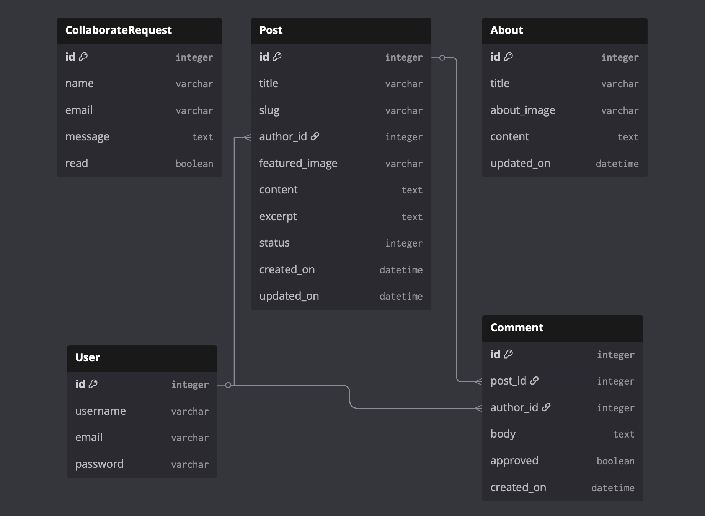

## Testing

Full testing documentation can be found in [TESTING.md](TESTING.md)

## Deployment

### Version Control

This project uses Git for version control and Github as the remote repository. All project files are tracked and managed through a systemic workflow:

- **Local Development**: Changes are made in the local development environment
- **Staging**: Modified files are added to the staging using 'git add'
- **Committing**: Changes are committed with descriptive messages using 'git commit-m "message"'
- **Pushing**: Commits are pushed to the remote GitHub repository using 'git push origin main'

This workflow ensured all changes are tracked, allowing for easy collaboration and the ability to revert to previous versions if needed.

### Deploying to Heroku

Fashion Tech blog is deployed using Heroku [Heroku](https://www.heroku.com/), a cloud platform service. These are the steps followed to deploy to Heroku.

Before deployment, ensure you have:
- A Heroku account
- The Heroku CLI installed (optional, for command-line deployment)
- A GitHub repository containing your project

#### Deployment Steps

* Select **New** in the top-right corner of your Heroku Dashboard, and select **Create new app** from the dropdown menu.
* Your app name must be unique, and then choose a region closest to you (EU or USA), and finally, select **Create App**.
* From the new app **Settings**, click **Reveal Config Vars**, and set your environment variables.

| Key | Value |
| --- | --- |
| `CLOUDINARY_URL` | user's own value |
| `DATABASE_URL` | user's own value |
| `DISABLE_COLLECTSTATIC` | 1 (this is temporary and can be removed for the final deployment) |
| `SECRET_KEY` | user's own value |

Heroku needs two additional files in order to deploy properly

* requirements.txt
* Procfile

You can install this project's **requirements** (where applicable) using:

* `pip3 install -r requirements.txt`

If you have your own packages that have been installed, then the requirements file needs updated using:

* `pip3 freeze --local > requirements.txt`

The **Procfile** can be created with the following command:

* `echo web: gunicorn fashiontech.wsgi > Procfile`
* replace **fashiontech** with the name of your primary Django app name; the folder where SETTINGS.py is located

For Heroku deployment, follow these steps to connect your own GitHub repository to the newly created app:

Either: 

* Select **Automatic Deployment** from the Heroku app.

Or:

* Navigate to the **Deploy** tab in your Heroku app
* Under **Deployment method**, select **GitHub**
* Search for your repository name and click **Connect**
* Scroll down to **Manual deploy** and click **Deploy Branch**
* Once deployment is complete, click **View** to open your deployed application


### Local Deployment

This project can be cloned of forked in order to make a local copy on your own system.

For either method, you will need to install any applicable packages found within the **requirements.txt** file.

* `pip3 install -r requirements.txt`

You will need to create a new file called `env.py` at the root-level, and include the same environment variables listed above from the Heroku deployment steps.

Sample `env.py` file:
```python
import os

os.environ.setdefault("CLOUDINARY_URL", "user's own value")
os.environ.setdefault("DATABASE_URL", "user's own value")
os.environ.setdefault("SECRET_KEY", "user's own value")

# local environment only (do not include these in production/deployment!)
os.environ.setdefault("DEBUG", "True")
```

Once the project is cloned or forked, in order to run it locally, you'll need to follow these steps:

* Start the Django app: `python3 manage.py runserver`
* Stop the app once it's loaded: `CTRL+C` or `⌘+C` (Mac)
* Make any necessary migrations: `python3 manage.py makemigrations`
* Migrate the data to the database: `python3 manage.py migrate`
* Create a superuser: `python3 manage.py createsuperuser`
* Everything should be ready now, so run the Django app again: `python3 manage.py runserver`

### Cloning

You can clone the repository by following these steps:

1. Go to the [GitHub repository](https://github.com/sineadezita/milestone-project-3)
2. Locate the Code button above the list of files and click it
3. Select if you prefer to clone using HTTPS, SSH, or GitHub CLI and click the copy button to copy the URL to your clipboard
4. Open Git Bash or Terminal
5. Change the current working directory to the one where you want the cloned directory
6. In your IDE Terminal, type the following command to clone the repository:
   * `git clone https://github.com/sineadezita/milestone-project-3`
7. Press Enter to create your local clone.

Alternatively, if using Gitpod, you can click below to create your own workspace using this repository.

[](https://gitpod.io/#https://github.com/sineadezita/milestone-project-3)

### Forking

By forking the GitHub Repository, we make a copy of the original repository on our GitHub account to view and/or make changes without affecting the original owner's repository.

You can fork this repository by using the following steps:

1. Log in to GitHub and locate the [GitHub Repository](https://github.com/sineadezita/milestone-project-3)
2. At the top of the Repository (not top of page) just above the "Settings" Button on the menu, locate the "Fork" Button.
3. Once clicked, you should now have a copy of the original repository in your own GitHub account!

## Credits

### Learning Resources

- **[Code Institute](https://codeinstitute.net/)** - Django walkthrough project "I Think Therefore I Blog" provided foundational structure and guidance
- **[Django Documentation](https://docs.djangoproject.com/)** - Official Django documentation
- **[Bootstrap Documentation](https://getbootstrap.com/docs/)** - Official Bootstrap documentation
- **[MDN Web Docs](https://developer.mozilla.org/)** - Web development reference materials

### Content
- All blog articles were generated using Claude.ai [Claude](https://claude.ai/)
- Article concepts were inspired by All Things Fashion Tech [All Things Fashion Tech](https://allthingsfashiontech.com/) by Mary Korlin-Downs