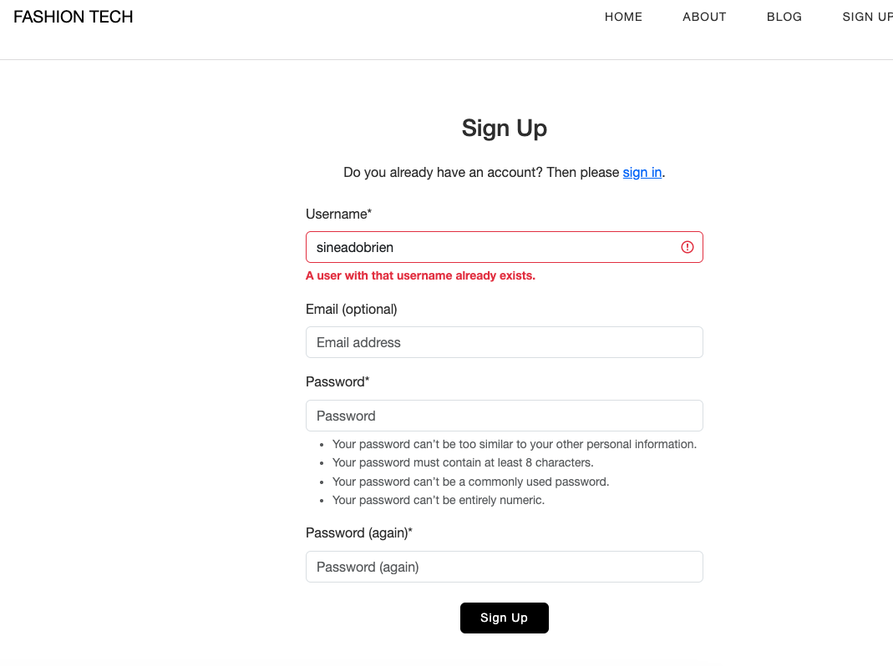
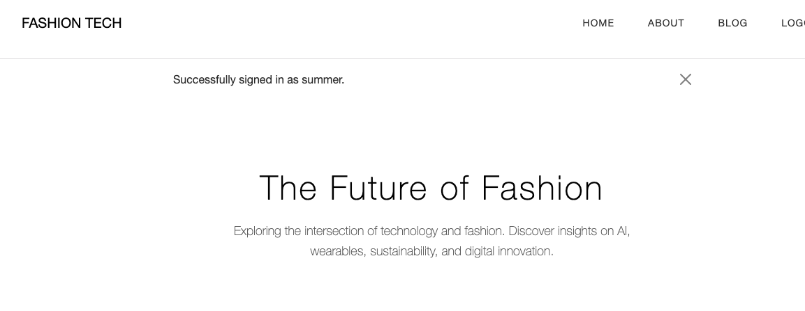
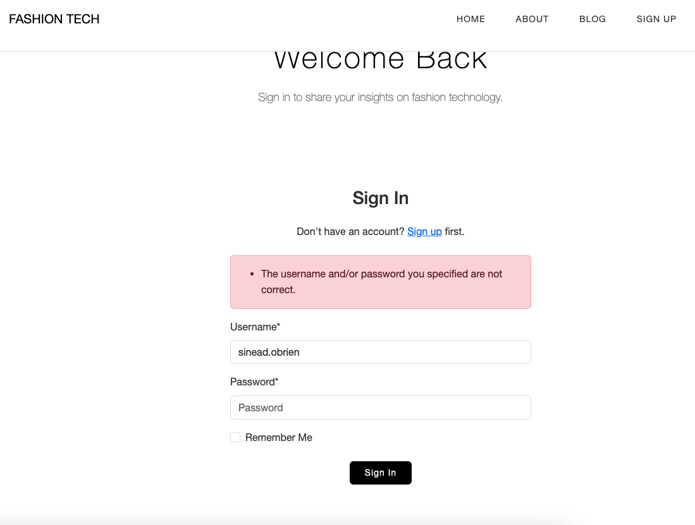
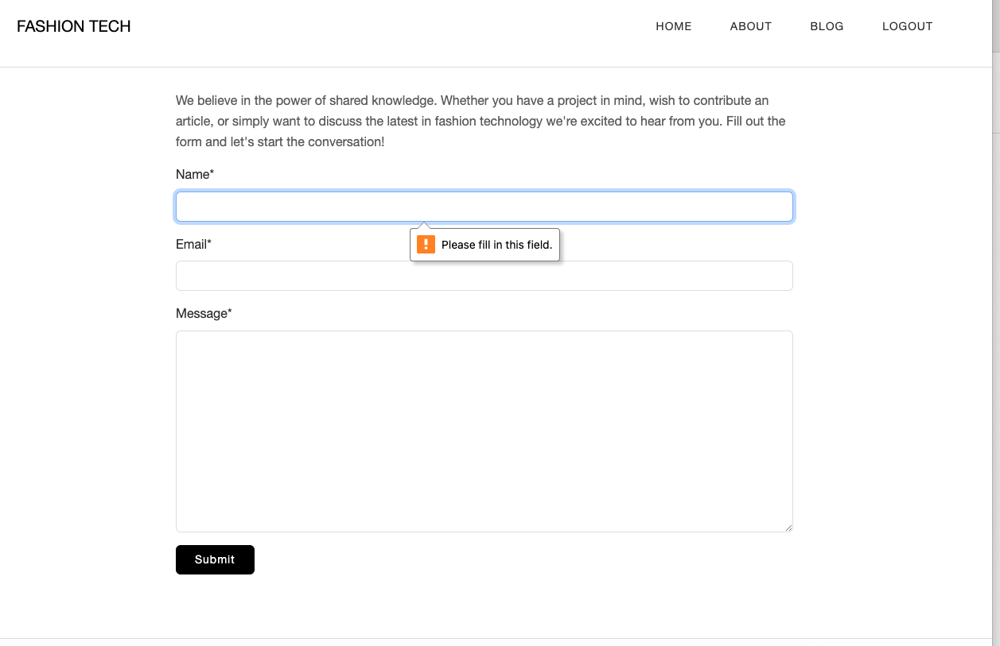
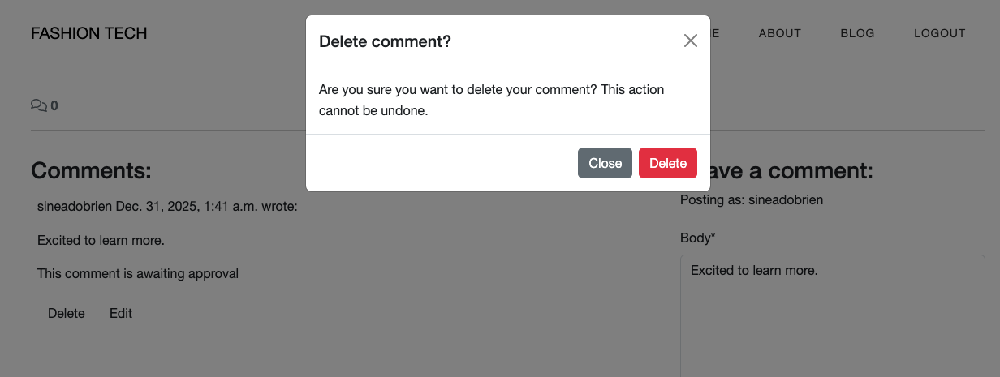
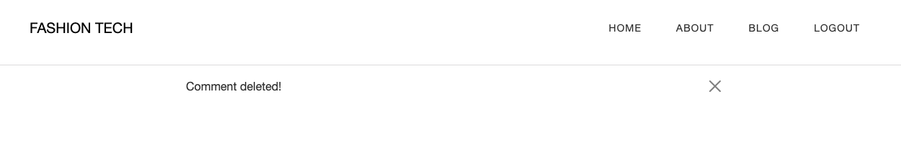
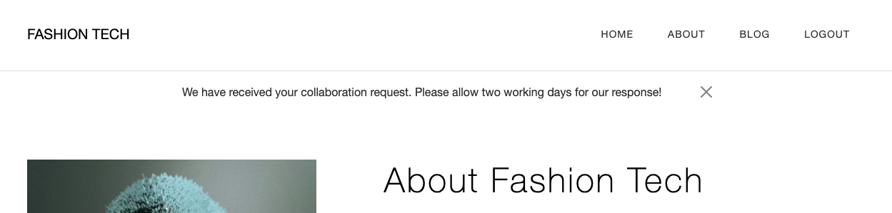
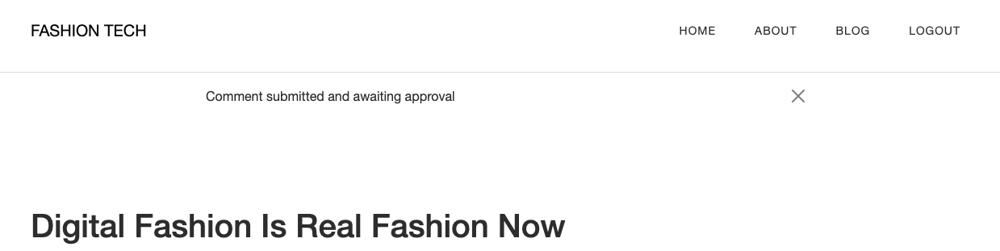

[Home Page](testing/home-page.png)

# Testing Documentation for Fashion Tech

## Validation

### HTML Validation

All pages pass HTML Validation at [W3C markup validation service](https://validator.w3.org/)

#### HTML Validation Errors

- Initial errors in HTML that were fixed during validation.

| Page | Result | Screenshot |
| --- | --- | --- |
| Home | Pass |  |
| About | Pass |  |
| Sign Up | Pass |  |
| Sign In | Pass |  |
| Sign Out | Pass |  |
| Article Detail | Pass |  |

### CSS Validation

CSS was validated using the [W3C CSS Validation Service]().

| File | Result | Screenshot |
| --- | --- | --- |
| style.css | Pass |  |

**Notes** 
- No errors found

### Javascript Validation

Javascript was validated using [JSHint](https://jshint.com/).

| File | Result | Screenshot |
| --- | --- | --- |
| comments.js | Pass |  |

**Configuration:**
- `esversion: 6` configured for ES6 syntax
- `globals bootstrap` configured for Bootstrap modal

**Notes**
- No errors found
- No undefined variables

### Python Validation

Python code was validated using PEP8 standards, using [CI Python Linter](https://pep8ci.herokuapp.com/).

| File | Result | Screenshot |
| --- | --- | --- |
| blog/views.py | Pass |  |
| blog/models.py | Pass |  |
| blog/forms.py | Pass |  |
| blog/urls.py | Pass |  |
| blog/admin.py | Pass |  |
| blog/apps.py | Pass |  |
| about/views.py | Pass |  |
| about/models.py | Pass |  |
| about/forms.py | Pass |  |
| about/urls.py | Pass |  |
| about/apps.py | Pass |  |
| fashiontech/urls.py | Pass |  |

**Notes**
- All Python files pass PEP8 validation
- No lines exceed 79 characters
- No trailing whitespace

## Manual Feature Testing

| Feature/Test | Expected Outcome | Result |
| --- | --- | --- |
| Logo in Navbar | Redirects to homepage | Pass |
| Nav Links | Redirect to relevant pages (Home, About, Blog ) | Pass |
| Footer Links | Open relevant sites in new tabs | Pass |
| Article Cards | Display 6 articles with images and details | Pass |
| Read Article Link | Redirects to article page | Pass |
| Pagination | Next/Previous buttons load correct pages | Pass |
| Sign Up Link | Redirects to registration page | Pass |
| Sign Up Form; empty field | Prompt to complete form | Pass |
| Sign Up Form; username exists | Form gives flash message | Pass |
| Sign Up Form; Valid details | Form submits and notifies user they are signed in | Pass
| Login Link. | Redirects to login page. | Pass |
| Login Form; empty. | Will not submit if empty fields. | Pass. |
| Login Form - incorrect username. | Form submits but doesn't login, displays error. | Pass |
| Login Form - incorrect password. | Form submits but doesn't login, displays error. | Pass |
| Login Form - correct details. | Form submits, logs in, redirects to homepage. | Pass |
| Navbar When Logged In. | Login/Sign Up replaced with Logout. | Pass |
|Collaboration Form - empty. | Will not submit empty fields. | Pass |
| Collaboration Form - valid. | Form submits, displays success message. | Pass. |
| Comment Form - logged out. | Shows "Log in to leave a comment". | Pass. |
| Comment Form - logged in. | Comment form displays with submit button. | Pass. |
| Submit Comment. | Comment submits, awaiting approval message displays. | Pass. |
| Edit Comment Button. | Appears on user's own comments only. | Pass. |
| Edit Comment. | Clicking edit populates form with comment text. | Pass. |
| Update Comment. | Submits update, displays success message. | Pass. |
| Delete Comment Button. | Appears on user's own comments only. | Pass. |
| Delete Comment - modal. | Confirmation modal pops up. | Pass. |
| Delete Comment - confirm. | Comment deleted, success message displays. | Pass. |
| Logout Button. | Redirects to logout confirmation page. | Pass. |
| Logout Confirmation. | Displays confirmation before logging out. | Pass. |
| Responsive Design. | Site adapts to mobile, tablet, desktop. | Pass. |

### Manual Testing Images

## User Stories Testing

### Visitor Goals

**View Articles**
- User Story: I can view articles to learn about fashion technology
- Feature: Home page displays paginated article list
- Test: Loaded home page, verified 6 articles display with pagination
- Result: ✅ Pass

**Read Full Articles**
- User Story: I can read full articles for detailed insights
- Feature: Article detail page shows complete content
- Test: Clicked article link, verified full content displays
- Result: ✅ Pass

**Create Account**
- User Story: I can create an account to comment on articles
- Feature: Sign Up form with username, email, password fields
- Test: Filled registration form, submitted, account created
- Result: ✅ Pass

**Submit Collaboration**
- User Story: I can contact site owner to propose collaboration
- Feature: Collaboration form on About page
- Test: Submitted form, verified in admin panel
- Result: ✅ Pass

### Registered User Goals

**View Articles**
- User Story: I can view articles to learn about fashion technology
- Feature: Home page displays paginated article list
- Test: Loaded home page, verified 6 articles display with pagination
- Result: ✅ Pass

**Read Full Articles**
- User Story: I can read full articles for detailed insights
- Feature: Article detail page shows complete content
- Test: Clicked article link, verified full content displays
- Result: ✅ Pass

**Create Account**
- User Story: I can create an account to comment on articles
- Feature: Sign Up form with username, email, password fields
- Test: Filled registration form, submitted, account created
- Result: ✅ Pass

**Submit Collaboration**
- User Story: I can contact site owner to propose collaboration
- Feature: Collaboration form on About page
- Test: Submitted form, verified in admin panel
- Result: ✅ Pass
